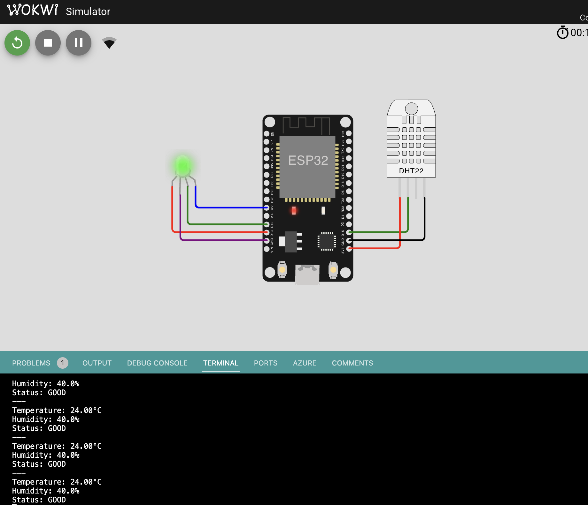
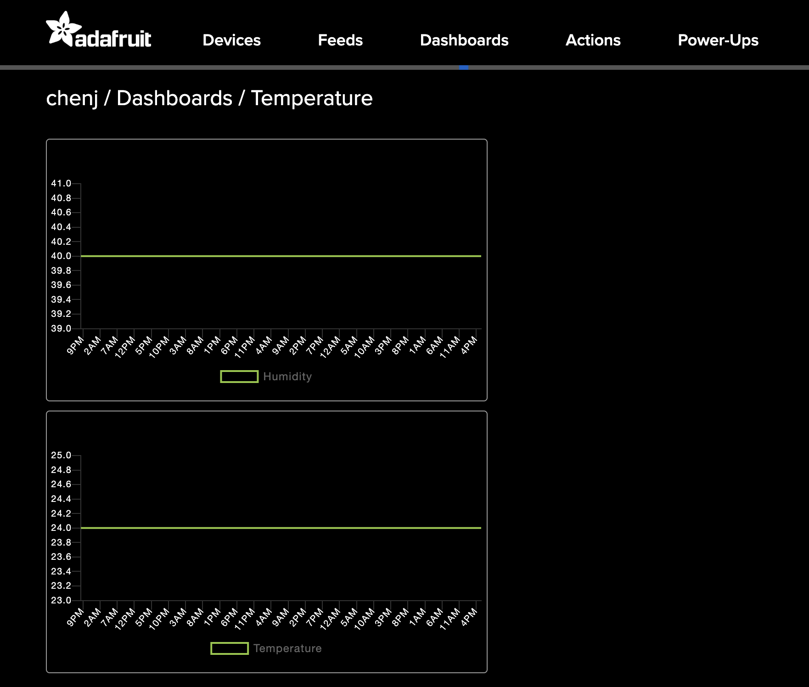

# ESP32 IoT Environmental Monitoring System

## 📌 Overview
This project is an IoT-based environmental monitoring system built with an ESP32. It collects temperature and humidity data using a DHT22 sensor, publishes the data to Adafruit IO via MQTT, and visualizes the environmental status using an RGB LED.

The system provides real-time insight into environmental conditions.
---

## 🚀 Features
- Reads temperature and humidity using **DHT22 sensor**
- Connects to WiFi (Wokwi-GUEST or real network)
- Sends data to **Adafruit IO (MQTT)**
- RGB LED indicates environment status:
  - 🟢 Green → Normal conditions
  - 🔴 Red → High temperature
  - 🔵 Blue → High humidity
  - 🟣 Purple → Both temperature and humidity are high
- Serial Monitor logs real-time sensor data and system status

---

## Hardware Used
- ESP32 DevKit V1
- DHT22 Temperature & Humidity Sensor
- RGB LED (Common Cathode)
- Resistors (if required in real hardware setup)

---

## 📌 Pin Configuration

| Component | ESP32 Pin |
|-----------|----------|
| DHT22 Data | GPIO 15 |
| Red LED    | GPIO 13 |
| Green LED  | GPIO 12 |
| Blue LED   | GPIO 27 |

---

## 🌐 IoT Platform
- **Adafruit IO**
- Protocol: MQTT
- Feeds:
  - `temperature`
  - `humidity`

---

## System Logic

| Condition | RGB Color | Meaning |
|----------|----------|--------|
| Normal | 🟢 Green | Safe environment |
| Temperature > threshold | 🔴 Red | Too hot |
| Humidity > threshold | 🔵 Blue | Too humid |
| Both high | 🟣 Purple | Critical environment |

---

## Threshold Values

- Temperature threshold: **25°C**
- Humidity threshold: **70%**

---

## How It Works
1. ESP32 connects to WiFi
2. Connects to Adafruit IO via MQTT
3. Reads DHT22 sensor every 2 seconds
4. Sends temperature & humidity data to cloud
5. Updates RGB LED based on conditions
6. Prints status to Serial Monitor

---

## Example Serial Output
## 📸 Wokwi Test Result

## 📸 Output Result

## 🎬 Demo Video

